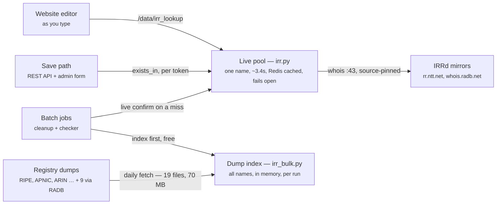
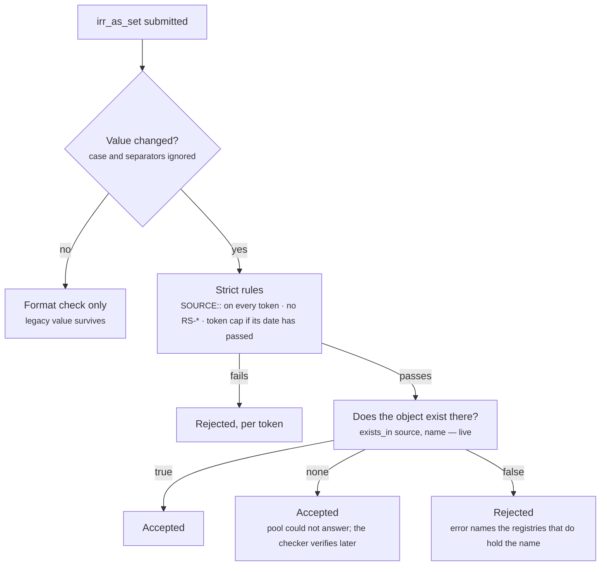
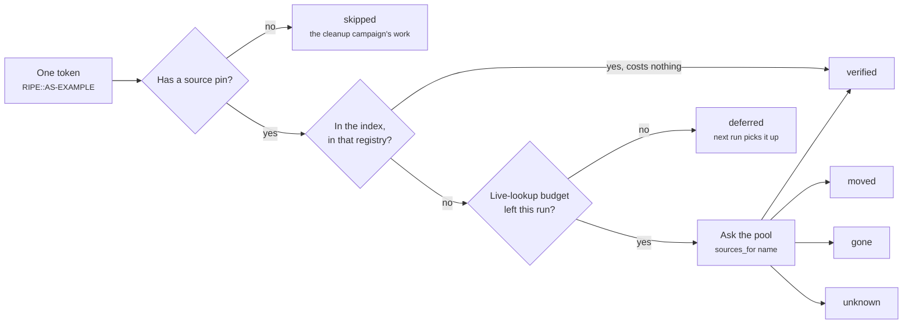

# IRR AS-SET verification — how it operates

High-level operation of the `irr_as_set` disambiguation and verification work
(#1973, with the single-set cap from #1974).

## The problem

Other networks read `irr_as_set` to build prefix filters. The same set name can
exist in several IRR registries with different members, and anyone can register a
colliding name in an open registry. A consumer holding only `AS-EXAMPLE` has to
guess where to look.

When #1973 was filed ~20,000 networks published a set name. The survey taken
then found almost 1,000 of those names could not be identified in any IRR at all,
just over 500 appear in more than one registry, and over 20 networks list the
literal string `AS-SET`. PeeringDB checked the format and nothing else, and never
looked at a value again after it was saved.

The fix is one rule and one new capability. Every token becomes `SOURCE::NAME`,
and PeeringDB gains a service that answers two questions about the IRRs: which
registries hold this object, and does this object exist in that registry.

## Three callers, two resolvers

The two resolvers differ in cost and freshness. The live pool answers one name at
a time over whois. The dump index answers thousands of names from memory.

The live pool is the only path that reaches the outside world during a request.
Dump-derived data is never served outward: the index exists only inside a running
command, and the editor lookup endpoint deliberately uses the live pool.

The editor endpoint is `GET /data/irr_lookup`, not an `/api/` route — it is a
website-only helper (session auth, rate limited) and is not part of the public
API surface.

## What happens on save

Enforcement is change-gated. The strict rules apply only when the submitted value
differs from the stored one, so a network with a legacy value can still update its
phone number. The moment anyone touches the field itself, the new rules apply.

Only a provably absent object is refused. An IRR outage yields unknown, and
unknown is accepted — the editability of PeeringDB must not depend on third-party
uptime. Superusers bypass the strict rules, as they already do for the
hierarchy-depth check.

## What the checker decides

A correctly prefixed value can still rot: registries delete objects, and operators
move them. The checker sweeps every network with a value on every run. It resolves
against the local index first and goes to the live pool only for a token the index
does not hold in its pinned registry. Nothing is ever flagged on a dump miss alone.

Four outcomes can land in the network's status column. Two more are run-local:
neither ever writes itself into that column, and both are counted separately in
the report so they are not folded into `unknown`.

| Outcome | Condition | What is recorded | Mail |
|---|---|---|---|
| `verified` | the pinned registry holds the object | `irr_as_set_verified` | no |
| `moved` | absent there, definitely present elsewhere | `irr_as_set_missing_since` | yes, naming the registry |
| `gone` | absent from every registry covered | `irr_as_set_missing_since` | yes, with reminders |
| `unknown` | the pool could not answer | the status column, unless a `moved`/`gone` verdict is standing | no |
| `skipped` (run-local) | a token carries no source pin | retracts any standing verdict | no |
| `deferred` (run-local) | `--max-lookups` was spent before this row | nothing; existing state is kept | no |

Only `moved` and `gone` assert that something is wrong, and only those two are
ever mailed. `unknown` means the pool could not answer, so no timestamp moves and
nothing is sent — mailing it would turn an IRR outage into a mass notification. It
does not overwrite a standing `moved` or `gone` either: the outage makes the pool
ignorant, not the value good, so a flagged network keeps its label and its
since-date on the record page, and stays in the missing-days histogram, until a
definitive answer replaces the verdict. A row carrying no verdict — verified, or
never swept — does record `unknown`.

`skipped` still causes a write, without claiming anything itself: the run looked
at every token and found none of them verifiable, so whatever verdict the row
carries is about a value the network no longer holds. It is retracted — status
back to `unknown`, both clocks and the verified stamp cleared. That is the
cleanup campaign's population. `deferred` keeps its state instead: the value may
still be the one the verdict was about, the run simply did not find out.

A value with several tokens takes the worst outcome among them.

The state lives on the network record and in the report to the Product Committee.
It is deliberately absent from the API: the public form of this flag arrives later
as a registered `net` metadata key (#1742), and the checker does not wait for it.

## Four jobs, and the order that matters

All four are dry-run by default and change nothing without `--commit`.

`pdb_irr_as_set_fetch` is the odd one in what it changes: it writes no database
rows and sends no mail either way. Under `--commit` it operates on
`IRR_BULK_DUMP_DIR` — in production the shared api-cache volume:
creating the directory, clearing the staging area, and downloading any source whose
serial moved or whose cache aged out. `--force` re-downloads the full ~70 MB
regardless.

Without `--commit` it reports what each source would do and exits, touching neither
the network nor the dump directory, so it also answers on a cold host. It is
deliberately offline, and that shows in the statuses: `would-download` when there is
no usable cache (or `--force`), `serial-decides` when there is one and the registry
publishes a serial, `fresh` only when file age is the whole decision. It never calls
an aged cache a download — once the cache is valid the real run compares the
published serial and ignores mtime, so a quiet mirror can be months old on disk and
still be a no-op. **The cron entry needs `--commit`** — without it the job runs,
reports, and refreshes nothing.

One ordering constraint is real and is enforced: the checker refuses to commit
against a dump set that is missing a registry or older than a day.

| Command | Cadence | What it does |
|---|---|---|
| `pdb_irr_as_set_fetch` | daily, with `--commit` | Refreshes the registry dumps. Skips a source whose serial is unchanged. Exits non-zero if any source went stale. |
| `pdb_irr_as_set_cleanup` | the campaign, then never | Adds the prefix where a name resolves to exactly one registry, and mails everyone whose value cannot be fixed automatically. |
| `pdb_irr_as_set_status` | after the fetch | Re-verifies every published value, records the outcome, mails the moved and the gone, prints the error-rate report. |
| `pdb_irr_as_set_notify` | cap soft window only | Warns networks listing more than one set name that the deadline is approaching. |

Two flag traps worth knowing before writing a cron entry:

- Zero is never "no cap". `--commit` hard-fails on `--max-changes 0`,
  `--max-lookups 0` or `--max-notifications 0` in all three DB-touching commands,
  so pass an explicit large value when you mean uncapped. Without `--commit` zero
  is accepted, because a dry run reporting the whole population costs nothing.
- The defaults `--max-lookups 1000` and `--max-notifications 100` make the first
  sweep over the full network set several passes by design. A partial first sweep
  is not a failure — the rows the budget did not reach are reported as `deferred`.

## The rollout

Issue #1973 — the prefix rule:

1. **Build and report** — lookup service, editor, enforcement.
2. **Cleanup and outreach** — on the order of 11k rewrites and 3k mails, roughly
   a month at the default pacing. See the note on where those figures come from
   at the end of this page.
3. **Steady state** — the checker runs, and keeps running.

Issue #1974 — the single-set cap, separate and dated: ships **off** (`0`), then a
**soft start** where the nudge mail goes out but lists stay valid, then a **hard
start** where a second set name is refused. Both dates are deployment settings.

Note that setting the soft-start date alone, with no hard-start date, makes the
cap warn-only. On a deployment where the cap is above zero that **relaxes**
enforcement rather than tightening it.

## Safeguards

- **Only a proven absence rejects.** The pool answers yes, no, or nothing.
  Nothing is not no.
- **The index narrows, the pool claims.** Every write and every mail is confirmed
  live first.
- **An unhealthy dump set blocks writing.** A missing registry makes an ambiguous
  name look unambiguous, so the cleanup refuses to commit rather than write the
  wrong prefix.
- **The caps are cursors.** Each run mails the next hundred and records who was
  told, so a re-run continues rather than repeating.
- **The operator's value wins.** A row edited during a run is left alone.
- **Nothing is ever deleted.** A value that stays gone is flagged and reported,
  not cleared.

---

Modules: `irr.py` (live pool), `irr_bulk.py` (dumps and index), `validators.py`
(enforcement), and the four commands under `management/commands/`. The module
docstrings carry the design detail, the failure modes and the flag semantics.
The problem figures above come from the survey in the #1973 spec. The rollout
figures come from a `pdb_irr_as_set_cleanup` dry run against a local development
database — prod-scale, but a snapshot of unknown age, so treat them as an order
of magnitude for pacing, not as a count of what the campaign will touch. Re-run
the dry run against current data before committing to a schedule.
